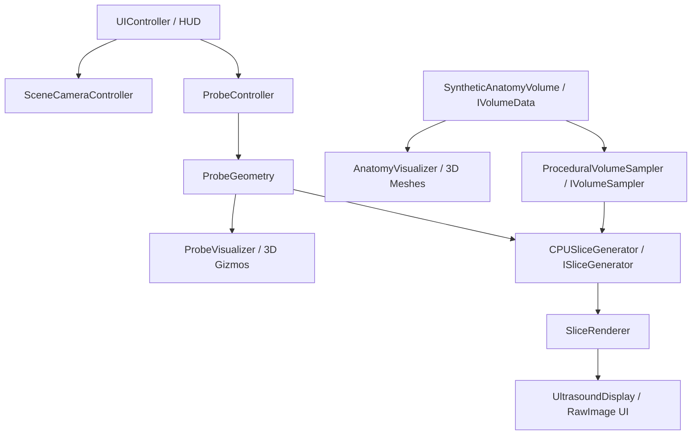

# Virtual Ultrasound Simulator

An interactive real-time 3D desktop simulator built with Unity and C#. The simulator allows a user to move and rotate a virtual ultrasound transducer over a 3D anatomical volume and observe the corresponding simulated 2D ultrasound cross-section in real time.

---

## Architecture Overview

The system is built on a clean, decoupled architecture where geometry, volume representation, rendering, probe kinematics, and UI operate independently.



### Core Components

| Component | Namespace | Responsibility |
|---|---|---|
| `ProbeGeometry` | `VirtualUltrasound.Probe` | Defines aperture width, max depth, probe type (Linear/Convex), and mapping from UV coordinates to probe space. |
| `ProbeController` | `VirtualUltrasound.Probe` | Manages 6-DOF translation and rotation input, smooth damping, and anatomical preset views (Transverse, Sagittal, Coronal). |
| `ProbeVisualizer` | `VirtualUltrasound.Probe` | Renders 3D transducer body, orientation marker dot, semi-transparent imaging plane quad, wireframe boundary, and normal vector. |
| `SyntheticAnatomyVolume` | `VirtualUltrasound.Volume` | Procedural 3D anatomical model combining body ellipsoid, hyperechoic organ sphere, anechoic cyst cavity, and fluid vessel cylinder. |
| `ProceduralVolumeSampler` | `VirtualUltrasound.Volume` | Implements `IVolumeSampler` to query tissue intensity at continuous world-space coordinates. |
| `AnatomyVisualizer` | `VirtualUltrasound.Volume` | Renders 3D transparent meshes and wireframes of the internal organs in the scene view. |
| `CPUSliceGenerator` | `VirtualUltrasound.Rendering` | High-performance, zero-allocation reference slice rasterizer. |
| `SliceRenderer` | `VirtualUltrasound.Rendering` | Manages `SliceBuffer` and `Texture2D` updates and frame render dispatch. |
| `UltrasoundDisplay` | `VirtualUltrasound.Rendering` | UI RawImage component with orientation notch, aspect ratio preservation, and depth scale. |
| `SceneCameraController` | `VirtualUltrasound.CameraControl` | Orbit, pan, and zoom 3D scene camera controller. |
| `UIController` | `VirtualUltrasound.UI` | Telemetry overlay (probe position in mm, Euler angles, resolution, frame rate) and view presets. |
| `SceneBootstrapper` | `VirtualUltrasound.Bootstrap` | Self-contained scene setup that builds cameras, lights, probe, volume, and split-screen UI on launch. |

---

## Coordinate Systems

To guarantee geometric correctness, coordinates follow an explicit 4-tier pipeline:

$$\text{Pixel }(i, j) \xrightarrow{\text{UV}} (u, v) \xrightarrow{T_{\text{Probe}}} p_P(u, v) \xrightarrow{T_{\text{World} \leftarrow \text{Probe}}} p_W \xrightarrow{T_{\text{Volume} \leftarrow \text{World}}} p_V \xrightarrow{\text{Sample}} \text{Intensity}$$

1. **Slice Image Space ($S$):** Integer pixels $(i, j) \in [0, W-1] \times [0, H-1]$ mapped to normalized $(u, v) \in [0, 1]^2$.
2. **Probe Space ($P$):** Origin at probe transducer contact center (apex).
   - $X_P$: Lateral axis across aperture $[-W/2, +W/2]$
   - $Y_P$: Elevation axis normal to imaging plane ($Y_P = 0$ on plane)
   - $Z_P$: Axial / depth axis into anatomy $[0, \text{Depth}]$
3. **World Space ($W$):** $p_W = \text{ProbePosition} + \text{ProbeRotation} \cdot p_P$
4. **Volume Space ($V$):** Evaluated against synthetic procedural anatomy primitives or 3D voxel fields.

---

## Interactive Controls

### Virtual Probe Controls (6-DOF)
- **Translate Lateral (X):** `A` / `D` or `Left Arrow` / `Right Arrow`
- **Translate Axial / Depth (Z):** `W` / `S` or `Up Arrow` / `Down Arrow`
- **Translate Elevation (Y):** `Q` / `E` or `Left Ctrl` / `Space`
- **Speed Multiplier:** Hold `Left Shift` / `Right Shift` (Fast movement)
- **Rotate Pitch (Tilt):** `I` / `K`
- **Rotate Yaw (Turn):** `J` / `L`
- **Rotate Roll (Twist):** `U` / `O`
- **Preset Views:**
  - `1`: Transverse View
  - `2`: Sagittal View
  - `3`: Coronal View
  - `R`: Reset Probe to Home

### 3D Scene Camera Controls
- **Orbit Camera:** `Right Mouse Button` + Drag (or `Alt` + `Left Mouse Button` + Drag)
- **Pan Camera:** `Middle Mouse Button` + Drag (or `Shift` + `Right Mouse Button` + Drag)
- **Zoom Camera:** `Mouse Scroll Wheel`
- **Focus Center:** `F` key

---

## How to Run the Simulator

### In Unity Editor
1. Open **Unity Hub** and add this folder (`virtual-ultrasound-simulator`).
2. Open the project using **Unity 2022.3 LTS** or **Unity 6 LTS**.
3. Open any scene (e.g. `SampleScene` or a fresh empty scene).
4. Add the `SceneBootstrapper` component to any GameObject, or hit **Play** (the bootstrapper auto-initializes all lighting, cameras, probe, volume, and split-screen UI).
5. Move the probe and observe the real-time ultrasound cross-section in the right-hand panel.

### Running Automated Tests
The mathematical core and coordinate transformations can be verified instantly via CLI:

```powershell
dotnet test tests/VirtualUltrasound.Tests/VirtualUltrasound.Tests.csproj
```

Or inside Unity using the **Test Runner** (`Window` > `General` > `Test Runner`).

---

## Current Limitations (Milestone 1)
- **Acoustic Physics:** The current slice displays pure tissue scalar intensity / geometry cross-sections without speckle noise, attenuation decay, acoustic shadows, or beam diffraction.
- **Probe Geometry:** Default probe is Linear; Curvilinear fan mode uses geometric sampling.
- **Dataset:** Procedural synthetic geometric volume (ellipsoid, sphere, cylinder); DICOM / volumetric CT/MRI loading is not included in this milestone.

---

## Development Roadmap
1. **Milestone 1 (Current):** Geometric reference architecture, 6-DOF probe interaction, split-screen UI, and procedural volume sampling.
2. **Milestone 2:** Probe geometry extensions (curvilinear sector scanline generation, phased array).
3. **Milestone 3:** GPU volume sampling (`Texture3D`, compute shader rasterization).
4. **Milestone 4:** Plausible ultrasound appearance (coherent spatial speckle, dynamic range compression, boundary enhancement, gain control).
5. **Milestone 5:** Acoustic propagation approximations (depth attenuation, bone shadowing, fluid enhancement).
6. **Milestone 6:** Real medical voxel data loader (DICOM / NRRD / NIfTI volumetric data import).
