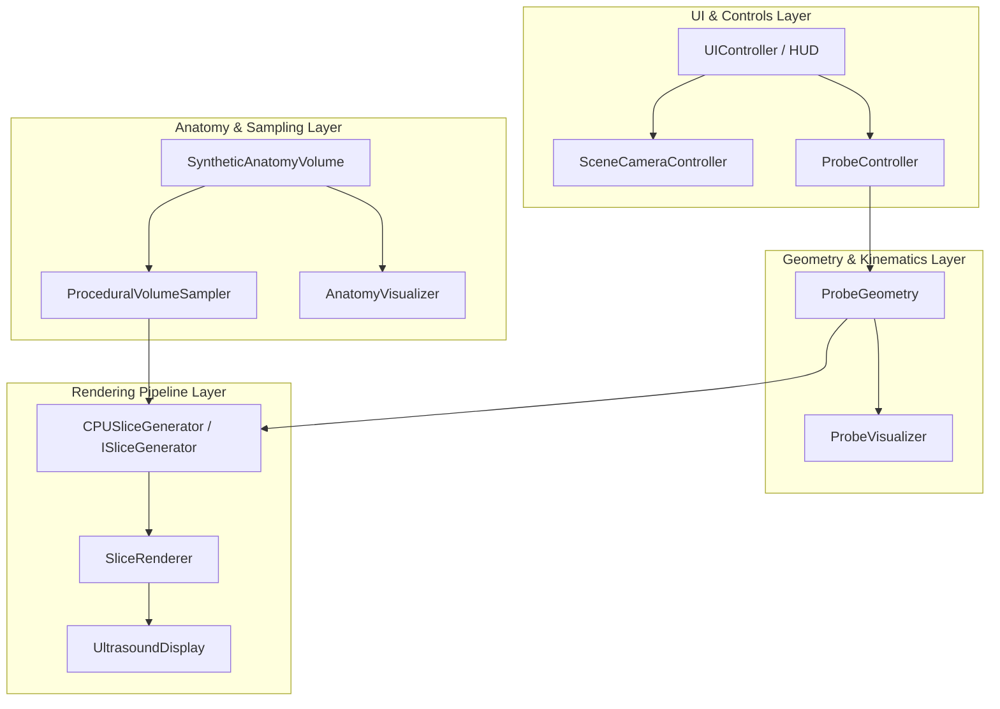

# Virtual Ultrasound Simulator


-brightgreen)


An interactive, real-time 3D desktop application built with **Unity** and **C#**. The simulator allows users to navigate a virtual ultrasound transducer over a 3D anatomical volume and observe the corresponding simulated 2D ultrasound cross-section in real time.

---

## Key Features (Milestone 1)

- **Split-Screen Desktop UI**: Interactive 3D scene viewport on the left (62% width), real-time 2D ultrasound monitor on the right (38% width).
- **Rigid 6-DOF Probe Kinematics**: Isolated `ProbeController` supporting smooth translation, rotation (pitch, yaw, roll), and anatomical preset views (Transverse, Sagittal, Coronal).
- **Procedural 3D Synthetic Anatomy**: Analytical multi-structure volume featuring a body ellipsoid, hyperechoic organ sphere, anechoic fluid cyst cavity, and fluid vessel cylinder.
- **Strict 4-Tier Coordinate Pipeline**: Complete mathematical decoupling between Image UV coordinates, Probe Space, World Space, and Volume Space.
- **Zero-Allocation CPU Slice Rasterizer**: High-performance reference pipeline running at 60+ FPS with zero per-frame managed heap allocations.
- **3D Spatial Visualizers & Gizmos**: Transducer body with orientation notch, semi-transparent imaging plane quad, wireframe boundary, beam vector ray, and 3D organ meshes.
- **Self-Assembling Scene Bootstrapper**: 1-click execution in any fresh Unity scene without manual asset configuration.
- **Deterministic Test Harness**: Standalone .NET test suite executable via CLI (`dotnet test`) and Unity EditMode test suite.

---

## Architecture Overview

The codebase is strictly decoupled into single-responsibility modules:



### Component Directory & Responsibilities

| Component | Namespace | Location | Responsibility |
|---|---|---|---|
| `CoordinateTransform` | `VirtualUltrasound.Core` | `Assets/Scripts/Core/` | Pure math functions converting between Image UV, Probe, World, and Volume spaces. |
| `SliceBuffer` | `VirtualUltrasound.Core` | `Assets/Scripts/Core/` | Pre-allocated reusable buffer storing raw float intensities and `Color32` pixel arrays. |
| `ProbeGeometry` | `VirtualUltrasound.Probe` | `Assets/Scripts/Probe/` | Defines aperture width, max depth, probe type (Linear/Convex), and corner positions. |
| `ProbeController` | `VirtualUltrasound.Probe` | `Assets/Scripts/Probe/` | Manages 6-DOF translation/rotation input, smooth damping, and preset views. |
| `ProbeVisualizer` | `VirtualUltrasound.Probe` | `Assets/Scripts/Probe/` | Renders 3D transducer model, marker dot, semi-transparent imaging plane quad, and rays. |
| `SyntheticAnatomyVolume` | `VirtualUltrasound.Volume` | `Assets/Scripts/Volume/` | Analytical SDF containment for body ellipsoid, organ sphere, cyst, and vessel. |
| `ProceduralVolumeSampler` | `VirtualUltrasound.Volume` | `Assets/Scripts/Volume/` | Implements `IVolumeSampler` to query tissue intensity at continuous 3D world coordinates. |
| `AnatomyVisualizer` | `VirtualUltrasound.Volume` | `Assets/Scripts/Volume/` | Renders 3D semi-transparent meshes and bounding wireframes of internal structures. |
| `CPUSliceGenerator` | `VirtualUltrasound.Rendering` | `Assets/Scripts/Rendering/` | Zero-allocation reference slice rasterizer. |
| `SliceRenderer` | `VirtualUltrasound.Rendering` | `Assets/Scripts/Rendering/` | Manages `Texture2D` updates and frame rendering loop. |
| `UltrasoundDisplay` | `VirtualUltrasound.Rendering` | `Assets/Scripts/Rendering/` | UI RawImage component with orientation notch and aspect ratio preservation. |
| `SceneCameraController` | `VirtualUltrasound.CameraControl` | `Assets/Scripts/Camera/` | Smooth 3D orbit, pan, and zoom camera controller. |
| `UIController` | `VirtualUltrasound.UI` | `Assets/Scripts/UI/` | Telemetry overlay (probe coordinates in mm, Euler angles, FPS) and preset buttons. |
| `SceneBootstrapper` | `VirtualUltrasound.Bootstrap` | `Assets/Scripts/Bootstrap/` | Zero-setup scene builder creating lighting, cameras, probe, volume, and split-screen UI. |

---

## Coordinate Transformations

The simulator enforces an explicit 4-tier coordinate pipeline:

$$\text{Pixel }(i, j) \xrightarrow{\text{UV}} (u, v) \xrightarrow{T_{\text{Probe}}} p_P(u, v) \xrightarrow{T_{\text{World} \leftarrow \text{Probe}}} p_W \xrightarrow{T_{\text{Volume} \leftarrow \text{World}}} p_V \xrightarrow{\text{Sample}} \text{Intensity}$$

1. **Slice Image Space ($S$):** Integer pixel index $(i, j) \in [0, W-1] \times [0, H-1]$ mapped to normalized UV:
   $$u = \frac{i}{W - 1}, \quad v = \frac{j}{H - 1}$$
2. **Probe Space ($P$):** Origin at probe contact face center (apex).
   - $X_P = (u - 0.5) \cdot \text{ApertureWidth}$ (Lateral axis across array)
   - $Y_P = 0$ (Elevation axis normal to imaging plane)
   - $Z_P = v \cdot \text{MaxDepth}$ (Axial / depth axis into tissue)
3. **World Space ($W$):** Rigid transformation:
   $$p_W = \text{ProbePosition} + \text{ProbeRotation} \cdot p_P$$
4. **Volume Space ($V$):** Continuous spatial query evaluated against analytical SDF primitives or 3D voxel fields.

---

## Interactive Controls

### Virtual Ultrasound Probe (6-DOF)

| Action | Primary Key | Alternate Key | Function |
|---|---|---|---|
| **Lateral Left / Right** | `A` / `D` | `Left` / `Right` Arrow | Moves probe along transducer width axis ($X_P$) |
| **Axial Forward / Backward** | `W` / `S` | `Up` / `Down` Arrow | Moves probe along beam depth axis ($Z_P$) |
| **Elevation Up / Down** | `Q` / `E` | `Left Ctrl` / `Space` | Moves probe normal to imaging plane ($Y_P$) |
| **Fast Move Multiplier** | `Left Shift` | `Right Shift` | Multiplies translation speed ($2.5\times$) |
| **Pitch (Tilt Forward/Back)** | `I` / `K` | — | Rotates probe around lateral axis |
| **Yaw (Turn Left/Right)** | `J` / `L` | — | Rotates probe around elevation axis |
| **Roll (Twist)** | `U` / `O` | — | Rotates probe around beam axis |
| **Transverse View Preset** | `1` | — | Positions probe for axial cross-section |
| **Sagittal View Preset** | `2` | — | Positions probe for longitudinal cross-section |
| **Coronal View Preset** | `3` | — | Positions probe for side/coronal cross-section |
| **Reset Home** | `R` | — | Resets probe to default home pose |

### 3D Scene Viewport Camera

| Action | Input | Function |
|---|---|---|
| **Orbit Camera** | `Right Mouse Button` + Drag | Rotates camera viewpoint around anatomy center |
| **Pan Camera** | `Middle Mouse Button` + Drag | Shifts the camera focus pivot in 3D |
| **Zoom Camera** | `Mouse Scroll Wheel` | Zooms toward / away from target |
| **Focus Target** | `F` | Re-centers camera on anatomy volume origin |

---

## Project Structure

```
virtual-ultrasound-simulator/
├── Assets/
│   ├── Scripts/
│   │   ├── Bootstrap/       # SceneBootstrapper (auto scene wiring)
│   │   ├── Camera/          # SceneCameraController (orbit/pan/zoom)
│   │   ├── Core/            # Coordinate transforms, interfaces, SliceBuffer
│   │   ├── Probe/           # ProbeGeometry, ProbeController, ProbeVisualizer
│   │   ├── Rendering/       # CPUSliceGenerator, SliceRenderer, UltrasoundDisplay
│   │   ├── UI/              # UIController, Telemetry HUD
│   │   ├── Volume/          # SyntheticAnatomyVolume, PrimitiveShapes, Visualizer
│   │   └── VirtualUltrasound.asmdef
│   └── Tests/
│       ├── Editor/          # Unity EditMode test suite
│       └── VirtualUltrasound.Tests.asmdef
├── Packages/
│   └── manifest.json        # Unity package dependencies (uGUI, Test Framework)
├── ProjectSettings/
│   └── ProjectVersion.txt   # Unity 2022.3 LTS configuration
├── docs/
│   ├── DECISIONS.md         # Append-only architecture decisions log
│   ├── PROGRESS.md          # Prepend chronological work log
│   └── tickets/             # Issue tracking (TEMPLATE.md)
├── tests/
│   └── VirtualUltrasound.Tests/ # Standalone .NET test suite for CLI
├── AGENTS.md                # AI agent and development guide
├── roadmap.md               # 10-phase project development roadmap
└── README.md
```

---

## How to Run

### Running in Unity
1. Open **Unity Hub** and click **Add** > select this project folder (`virtual-ultrasound-simulator`).
2. Open with **Unity 2022.3 LTS** or **Unity 6 LTS**.
3. Open any scene (or create a new empty scene).
4. Hit **Play** (the `SceneBootstrapper` automatically generates all cameras, lights, probe, volume, and split-screen UI).
5. Use keyboard controls (`W/A/S/D`, `I/K/J/L/U/O`) to navigate the probe and inspect the live ultrasound cross-section.

### Running Automated Tests via CLI
To mathematically verify all coordinate transforms and volume sampling without opening Unity:

```powershell
# Build test assembly
dotnet build tests/VirtualUltrasound.Tests/VirtualUltrasound.Tests.csproj

# Run all automated tests
dotnet test tests/VirtualUltrasound.Tests/VirtualUltrasound.Tests.csproj
```

---

## Current Scope & Limitations (Milestone 1)

- **Acoustic Physics**: Currently displays geometric tissue cross-sections; acoustic wave phenomena (speckle noise, attenuation decay, acoustic shadows, beam diffraction) are planned for Milestones 4 & 5.
- **Probe Geometry**: Linear array probe geometry is fully implemented; Curvilinear sector fan mode is geometrically approximated.
- **Volume Data**: Procedural synthetic geometric volume (ellipsoid, sphere, cylinder); DICOM / NRRD volumetric medical datasets are scheduled for Milestone 6.

---

## Development Roadmap

1. **Milestone 1 (Shipped):** Geometric reference architecture, 6-DOF probe interaction, split-screen UI, and procedural volume sampling.
2. **Milestone 2:** Ultrasound-shaped acquisition geometry (curvilinear sector ray fans, phased array).
3. **Milestone 3:** GPU volume sampling (`Texture3D`, compute shader rasterization).
4. **Milestone 4:** Plausible ultrasound appearance (coherent spatial speckle, dynamic range compression, boundary enhancement, gain control).
5. **Milestone 5:** Acoustic propagation approximations (depth attenuation, bone shadowing, fluid enhancement).
6. **Milestone 6:** Real medical voxel data loader (DICOM / NRRD / NIfTI volumetric data import).
7. **Milestone 7:** Training scenarios, target plane scoring, and AI probe guidance.

---

## Devlog & Project Memory

- **Architecture Decisions**: [docs/DECISIONS.md](file:///c:/Tsahi/Coding/virtual-ultrasound-simulator/docs/DECISIONS.md)
- **Progress Log**: [docs/PROGRESS.md](file:///c:/Tsahi/Coding/virtual-ultrasound-simulator/docs/PROGRESS.md)
- **Agent Instructions**: [AGENTS.md](file:///c:/Tsahi/Coding/virtual-ultrasound-simulator/AGENTS.md)
- **Roadmap**: [roadmap.md](file:///c:/Tsahi/Coding/virtual-ultrasound-simulator/roadmap.md)
